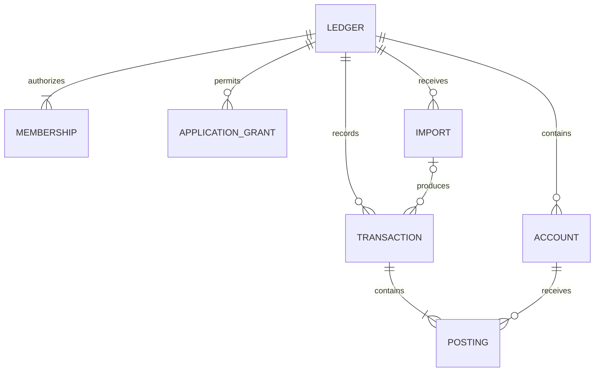

# Finance Ledger: initial design

Status: Draft. Date: 2026-10-06. Baseline: AccountsService mainline `72f3965`.

Miguel approved a ledger for personal finances that other users can also use, with private books and permission-based collaboration by people and applications. This document captures that direction; the APIs and schema below are proposed, not implemented.

## Starting from the existing API

| Current endpoint | Current operation |
| --- | --- |
| `POST /api/accounts` | Create an account and its children; return its ID. |
| `GET /api/accounts` | Return ordered pages including children, with limit/offset/hasMore. |
| `GET /api/accounts/{id}` | Read one account and its children. |
| `PUT /api/accounts` | Update the account, update supplied children with IDs, create children with null IDs. Omitted children remain. |
| `DELETE /api/accounts/{id}` | Delete the account and cascade-delete its children. |
| `DELETE /api/subAccounts/{id}` | Delete one child independently. |
| `GET /api/ping`, `GET /api/deep_ping` | Check the service and database respectively. |

The existing model has Account, SubAccount, audit timestamps and types Expenses/Capital/Entry. It has no monetary amounts, postings, ledger ownership or balances. API access is anonymous. The request user strings are unverified, and updatingUser is required but unused by PutAccountComponent. These fields cannot establish authorization.

Sources: [controllers](../../accounts-service/src/main/java/com/mgl/accountsservice/controllers/), [PutAccountComponent](../../accounts-service/src/main/java/com/mgl/accountsservice/components/PutAccountComponent.java), [security](../../accounts-service/src/main/java/com/mgl/accountsservice/spring/WebSecurityConfig.java), [schema](../../accounts-service/src/main/resources/db/schema/).

## Domain proposal

| Entity | Responsibility |
| --- | --- |
| Ledger | A private financial book, such as personal, household or business finances. |
| Membership | A verified user's role within a ledger. Proposed roles: owner, editor, viewer. |
| Account | A financial classification within one ledger: asset, liability, equity, income or expense. |
| Transaction | An immutable financial event with effective date, description, source and recorded actor. |
| Posting | A positive exact amount on the debit or credit side of an account within a transaction. |
| Import | A staged external submission with validation results and deduplication identifiers. |
| ApplicationGrant | An application's explicit permissions on one ledger, granted by an authorized owner. |

Proposed first-version currency boundary: each ledger has one currency and defined precision, and its accounts use that currency. Multi-currency conversion is deferred. Accounts may eventually form a hierarchy; SubAccount does not automatically become a second financial entity. The hierarchy and migration mapping need a separate decision.

For a 500 MXN food purchase from a bank account, one transaction records a 500 debit to Food Expense and a 500 credit to Bank Asset. The user can enter a simple expense while the service builds the balanced postings internally. A transfer between two asset accounts does not count as income or expense.

## Rules and access boundary

Every account, posting, transaction and import belongs to exactly one ledger. All reads and writes check the caller's verified identity and ledger permissions, including referenced account IDs. Authentication alone does not grant ledger access.

An owner administers memberships and application grants; an editor records events; a viewer reads. An application receives only explicit ledger-scoped permissions, such as submit imports. Users and applications are distinct principals; an application's submitted user name never impersonates a user. The token issuer, verification protocol and invitation lifecycle remain open decisions.

A committed transaction has at least two postings. Total debits equal total credits; all accounts are active and belong to that ledger. Amounts use integer minor units with checked ranges and explicit currency precision, never floating point. Transactions and postings commit atomically in PostgreSQL. Balances derive from committed postings; callers do not edit balances directly.

Committed financial content is immutable. Corrections create linked reversals or adjustments. A reversal offsets the original postings once, under the same concurrency controls. Accounts with history are archived rather than deleted; financial history never cascades away with an account.

Retries use an idempotency key scoped to ledger and principal, plus a fingerprint of the operation and payload. The result is stored with the financial write: matching retries replay it, changed payloads conflict, and concurrent retries cannot create duplicate transactions.

Imports first stage and validate rows. An editor or explicitly authorized application then commits valid transactions. Row outcomes and source identifiers allow safe retries without counting the same event twice. External uploads cannot bypass ledger permissions or posting rules.

## API direction and compatibility

Use `/api/v2/ledgers/{ledgerId}` for the new boundary. Proposed operations:

| Operation | Route |
| --- | --- |
| Create/list accessible books | `POST/GET /api/v2/ledgers` |
| Manage memberships | `POST/PATCH/DELETE .../memberships` with explicit member IDs for changes |
| Create/list accounts | `POST/GET .../accounts` |
| Edit/archive one account | `PATCH .../accounts/{accountId}` |
| Record/list events | `POST/GET .../transactions` |
| Read/reverse one event | `GET .../transactions/{transactionId}`, `POST .../transactions/{transactionId}/reversals` |
| Stage/read/commit a load | `POST .../imports`, `GET .../imports/{importId}`, `POST .../imports/{importId}/commit` |

Create and edit are separate operations; editing an account never implicitly creates children or financial events. If account hierarchy is retained, expose explicit child creation and editing. Reserve PUT for complete replacement semantics, following [RFC 9110](https://www.rfc-editor.org/rfc/rfc9110.html#section-9.3.4).

Legacy `/api/accounts` remains unchanged during design. Before storing real ledger data, its anonymous global access must be isolated from the new ledger tables or retired. Existing createdBy strings do not prove ownership; migration requires an explicit owner mapping. Expenses/Capital/Entry require reviewed mappings, especially Entry. No automatic migration or destructive schema rewrite is approved by this document.

## Small implementation sequence

1. **Identity, ledgers and memberships:** decide token verification; create private books and enforce read/write isolation. Acceptance: two users cannot access each other's books; viewer writes and ungranted application submissions fail before persistence.
2. **Ledger accounts:** introduce account types, currency and archive behavior. Acceptance: all references are ledger-scoped; account edits cannot create children or postings implicitly.
3. **Transactions and postings:** implement expenses, income, transfers, balances and reversals. Acceptance: unbalanced/cross-ledger writes fail atomically; duplicate and concurrent retries create one event; reversal preserves the original history.
4. **Collaborative imports:** stage, validate and commit external loads using explicit grants. Acceptance: row-level results, permission checks and repeat-load deduplication work against the packaged API and PostgreSQL.

Each step can be split into small stacked draft PRs with SQL and real HTTP regression coverage. The first delivery is private books with membership isolation, not the entire ledger. Keep the existing CRUD/security test suite as a safety net.

## Open decisions

- Token verification and integration contract with AuthorizationService.
- Invitation acceptance, application grant issuance and revocation.
- Account hierarchy and migration of existing data/types.
- Import formats, source deduplication policy and idempotency retention.
- Currency precision/range, effective-date timezone and opening-balance workflow.

Bank connectivity, foreign exchange, tax reporting, payment execution and an agent-facing tool are later capabilities. They are not prerequisites for the first private-book delivery.
